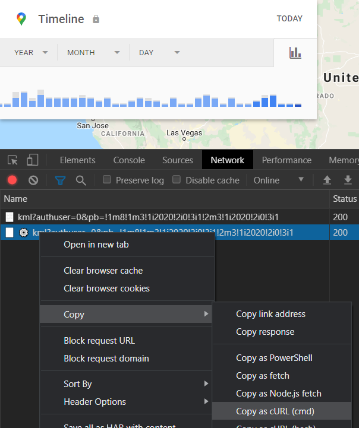

# TimelineExtractor

[![Software License][ico-license]](LICENSE.md)

Extract location history from Google Maps Timeline.

## Introduction

By enabling Location History in Google Maps, Google will save your location data and processes it in order to create your personal [Timeline](https://www.google.com/maps/timeline).

You can easily [download the raw data](https://takeout.google.com/) saved by Google. It is also possible to download the processed location history for a single day, but not to download more than one day at a time.

`TimelineExtractor` lets you easily download your location history. There are multiple options for specifying which dates to download:
- Specify one or more dates.
- Specify a date range.
- Specify one or more photos or directories, to download location history for the capture dates of the photos and contained photos.

Google Timeline exports your location history using the `kml` format. There are som issues with how Google formats the files, making them incompatible with software such as [GPSBabel](https://www.gpsbabel.org). `TimelineExtractor` takes care of these issues, generating valid `kml` files.

## Installation

Use the following commands to set up `TimelineExtractor`.

Download `TimelineExtractor`:

``` bash
git clone --depth 1 https://github.com/Stadly/TimelineExtractor.git
```

Install dependencies:

``` bash
pip install -r TimelineExtractor/requirements.txt
```

Change working directory:

``` bash
cd TimelineExtractor/src
```

### Authentication

In order to download location history from Google Maps, you must be authenticated. Authentication is done by passing an authentication cookie to `TimelineExtractor`.

Follow the steps below to get your authentication cookie from Google Maps Timeline:

1. Go to [Timeline](https://www.google.com/maps/timeline) using [Google Chrome](https://www.google.com/chrome/) or another Chromium-based browser.
2. Open `Developer tools` (`Ctrl+Shift+I`).
3. Go to the `Network` tab.
4. Enter this URL in the address bar of your browser: `https://www.google.com/maps/timeline/kml?authuser=0&pb=!1m8!1m3!1i2020!2i0!3i1!2m3!1i2020!2i0!3i1`
5. A new request will appear in the `Developer tools`. Copy it as `cURL`.

   

6. Paste the copied request into a text editor.
7. You should get something like this:
```
curl "https://www.google.com/maps/timeline/kml?authuser=0^&pb=^!1m8^!1m3^!1i2020^!2i0^!3i1^!2m3^!1i2020^!2i0^!3i1" ^
  -H "accept: text/html,application/xhtml+xml,application/xml;q=0.9,*/*;q=0.8" ^
  -H "accept-language: en" ^
  -H "authority: www.google.com" ^
  -H "cookie: <COOKIE CONTENT>" ^
  -H "user-agent: Mozilla/5.0" ^
  --compressed
```

8. Save the cookie content (what is replaced by `<COOKIE CONTENT>` above) so you can use it to authenticate requests sent by `TimelineExtractor` when downloading location history. It is recommended to store it in a file called `cookie` in the directory `src`, as that will be assumed in most of the examples further down.

### Install in Docker container

It is also possible to set up and use `TimelineExtractor` in a docker container instead of installing it locally. See the section [Using Docker](#using-docker) for details.

## Usage

`TimelineExtractor` is run with the python file `extract.py`:

```
python extract.py
```

### Authenticate

To authenticate, specify the path to your authentication cookie using the `-c` or `--cookie` argument when running `TimelineExtractor`:

```
python extract.py -c path/to/cookie
```

### Get location history

There are three ways to specify which dates to extract location history for:
1. [Specify one or more dates](#get-location-history-for-one-or-more-dates).
2. [Specify a date range](#get-location-history-for-a-date-range).
3. [Specify one or more photos or directories](#get-location-history-for-one-or-more-photos-or-directories), to download location history for the capture dates of the photos and contained photos.

#### Get location history for one or more dates

To download location history for a date, simply use the `date` mode and specify the date in `YYYY-MM-DD` format:

``` bash
python extract.py -c cookie date 2020-01-01
```

If you specify multiple dates, location history will be downloaded for all of them:

``` bash
python extract.py -c cookie date 2020-01-01 2020-01-05 2020-02-10
```

#### Get location history for a date range

To download location history for a date range, simply use the `range` mode and specify the first date and last date in `YYYY-MM-DD` format:

``` bash
python extract.py -c cookie range 2020-01-01 2020-01-31
```

#### Get location history for one or more photos or directories

To download location history for the capture date of a photo, simply use the `photo` mode and specify the path to the photo:

``` bash
python extract.py -c cookie photo path/to/photo.jpg
```

If you specify a directory, location history will be downloaded for all the photos in the directory:

``` bash
python extract.py -c cookie photo path/to/directory
```

If you specify multiple paths, location history will be downloaded for all of them:

``` bash
python extract.py -c cookie photo path/to/photo.jpg path/to/directory
```

Use the `-s` or `--subdir` argument to download location history also for photos in subdirectories of the specified directories:

``` bash
python extract.py -c cookie photo -s path/to/directory-tree
```

### Store the location history

The downloaded location history is written to `stdout`. To store it in a file, simply redirect `stdout` to the file:

``` bash
python extract.py -c cookie date 2020-01-01 > path/to/location-history.kml
```

### Logging output

Any logging output generated by `TimelineExtractor` is written to `stderr`. There are five levels of logging:

1. debug
2. info
3. warning
4. error
5. critical

By default, `info` and higher log messages are output. Use the `-l` or `--log` argument to specify which levels of log messages to output:

``` bash
python extract.py -l debug -c cookie date 2020-01-01
```

### Using Docker

[Docker](https://www.docker.com) makes setting up and using `TimelineExtractor` really easy. All you have to do is build the docker image, and you can use `TimelineExtractor` without installing any dependencies (even Python!) locally.

#### Build the docker image

Build the docker image using the following command. Note that you should [save you authentication cookie](#get-authentication-cookie) before building the docker image so that it becomes part of the image.

``` bash
docker build -t timeline-extract .
```

#### Run the docker container

After the image is built, just run it to use `TimelineExtractor`. The syntax when running `TimelineExtractor` inside the docker container is the same as when running it locally, except that `python extract.py` is replaced by `docker run timeline-extract`.

For example, the following command will extract location history for the date `2020-01-01` and store it in the file `timeline.kml` in your current working directory:

``` bash
docker run timeline-extract -c cookie date 2020-01-01 > timeline.kml
```

When extracting location history for photos, the docker container must be able to access to the photos in order to get their capture dates. This is achieved by mounting the directories containing the photos to the docker container. When mounting a directory, specify the absolute path of the directory in the local file system as the `source`, and the absolute path of where to mount it in the container as `destination`. Use the destination paths when specifying the photos and directories to get location history for.

In the following example, the local directory `/path/to/photos` is mounted to `/photos` in the container. Location history is then calculated for the photo `/photos/my-image.jpg` (refers to `/path/to/photos/my-image.jpg` in the local file system) and the photos contained in `/photos/more-photos` (refers to `/path/to/photos/more-photos` in the local file system).

``` bash
docker run --mount source=/path/to/photos,destination=/photos timeline-extract -c cookie photo /photos/my-image.jpg /photos/more-photos
```

## Change log

Please see [CHANGELOG](CHANGELOG.md) for information on what has changed recently.

## Security

If you discover any security related issues, please email magnar@myrtveit.com instead of using the issue tracker.

## Credits

- [Magnar Ovedal Myrtveit][link-author]
- [All contributors][link-contributors]

## License

The MIT License (MIT). Please see [License file](LICENSE.md) for more information.

[ico-license]: https://img.shields.io/badge/license-MIT-brightgreen.svg?style=flat-square

[link-author]: https://github.com/Stadly
[link-contributors]: ../../contributors
